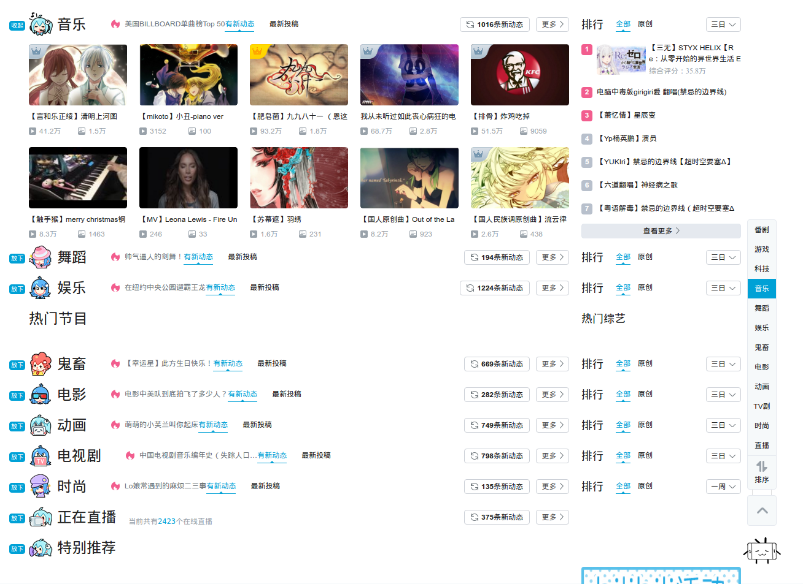

# bilibili助手
### 可选功能
* 去掉消息红点
* 折叠

### chome下安装方法
* 安装[油猴脚本插件](https://chrome.google.com/webstore/detail/dhdgffkkebhmkfjojejmpbldmpobfkfo)
* 点击右上角插件图标-Dashboard-Utilities 
* 把 http://blackmiaool.com/bilibili_helper/index.js 这个地址粘贴到输入框,点import
* 点击install
* 进入B站